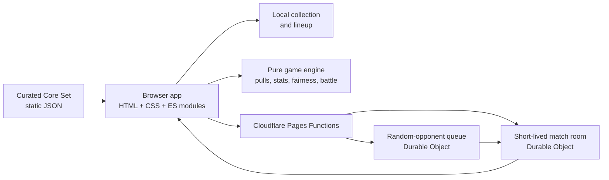
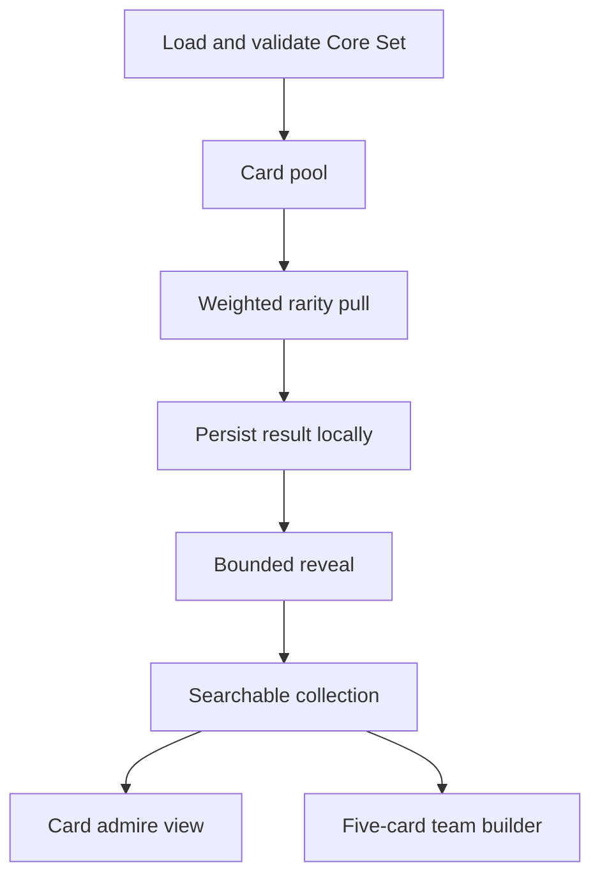
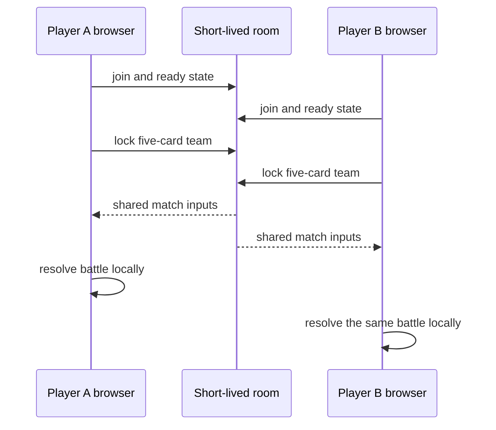

# Creator Gacha Architecture

This is the shortest path into the codebase. Creator Gacha is a static, browser-first game with
one small coordination backend for cross-device battles. The browser owns the collection and
resolves the game; the server only helps two browsers meet and agree on match inputs.

## System at a glance

The architecture keeps three kinds of code separate:

| Layer | May touch | Main locations |
|---|---|---|
| Pure engine | Plain data only | `src/engine/` |
| Data adapters | Network and external data shapes | `src/data/`, `functions/` |
| UI | DOM, input, motion, and accessibility | `src/ui/`, `styles.css`, `index.html` |

`src/main.js` is the composition root. It introduces these layers through callbacks and shared
state rather than allowing UI modules to import each other freely.

## Pull and collection flow

The pull is decided and saved before its animation starts. Rarity and battle statistics are pure,
deterministic derivations, so every surface reads the same card identity and numbers.

## Multiplayer boundary

There are no accounts, permanent server-side collections, leaderboards, or stored battle results.
Rooms expire, and Quick Battle never needs the backend.

## Public data and repository rules

- The committed catalog contains channel IDs and curation metadata, not hydrated statistics.
- Generated sets under `sets/built/` are excluded from Git history and refreshed for deployment.
- API keys, Cloudflare tokens, local state, reports, and assembled `_site/` output are ignored.
- Browser persistence uses positive allowlists for stored channel fields.
- Creator removals are recorded in the denylist and reapplied during future set builds.

## Detailed documents

- [Frontend architecture](FRONTEND-ARCHITECTURE-05-09-2026.md) covers page surfaces, card
  rendering, reveal behavior, persistence, responsive design, and the arena state machine.
- [Backend architecture](BACKEND-ARCHITECTURE-05-09-2026.md) covers Pages Functions, Durable
  Objects, room and queue lifecycles, deployment, and privacy boundaries.
- [Hero showcase architecture](HERO-SHOWCASE-ARCHITECTURE.md) covers first-visit chase cards and
  returning-player rankings.
- [V2 UI work package](WP-V2-UI-OVERHAUL.md) records the redesign decisions and verification.
- [Design decisions](DECISIONS.md) is the long-form decision log.

For setup and repository conventions, see [CONTRIBUTING.md](CONTRIBUTING.md).
