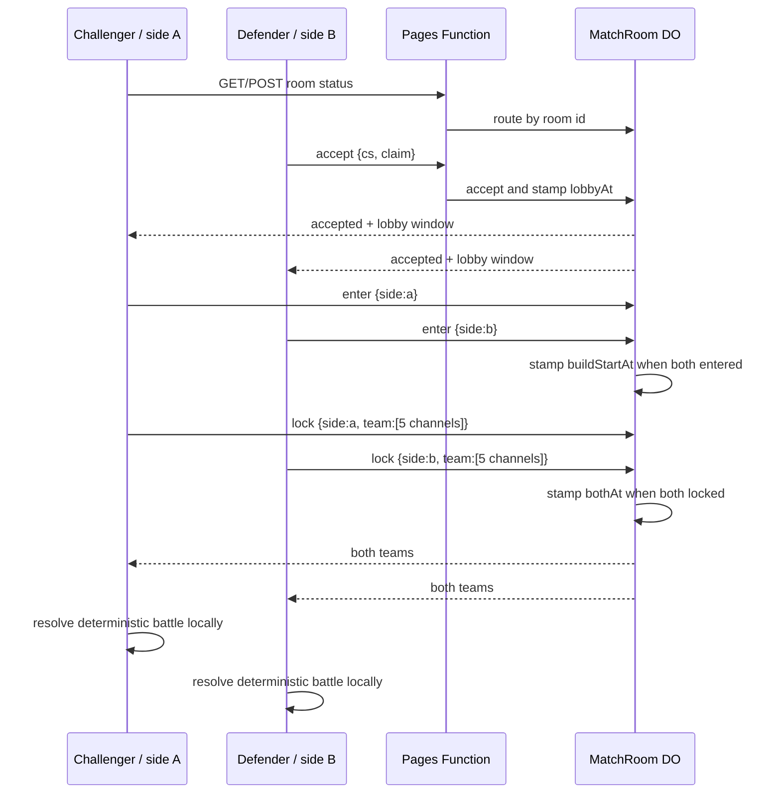
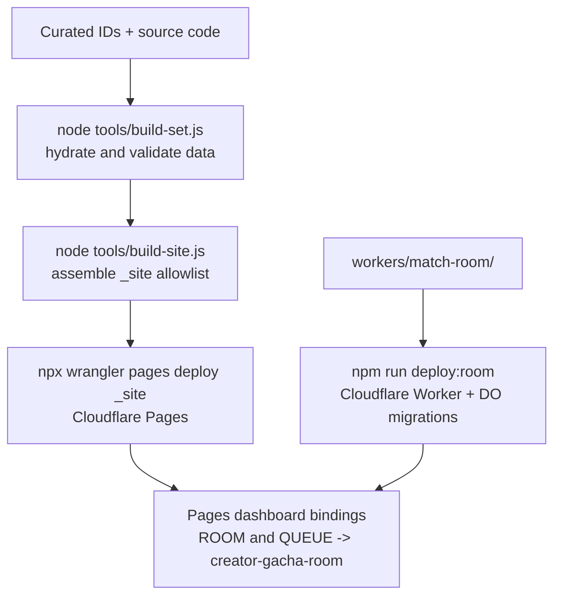

# Creator Gacha Backend Architecture

> Last verified against the current Pages Functions, Durable Objects, and browser adapters on
> 2026-09-24. No structural rewrite was required.

## 1. System Summary

Creator Gacha is a browser-first YouTube creator card game. The deployed application is a static Cloudflare Pages site with vanilla ES modules. Most game behavior runs locally in the browser:

- Curated card-set JSON is loaded from the deployed site.
- Card rarity, battle statistics, fairness selection, gacha pulls, and battle resolution are pure JavaScript.
- The collection and lineup are stored in the player's browser with `localStorage`.
- Quick battle needs no backend.
- Cross-device and random-opponent battles use a small optional coordination backend.

The backend is intentionally narrow. It does not own accounts, profiles, rankings, permanent collections, battle results, or YouTube API credentials. Its job is to coordinate two browsers long enough for them to agree on the inputs to a deterministic battle.

## 2. Deployment Topology

```mermaid
flowchart LR
    Browser[Player browser\nstatic ES modules] --> Pages[Cloudflare Pages\ncreator-gacha.pages.dev]
    Pages --> Assets[Static HTML, CSS, JS\nand curated set JSON]
    Browser -->|same-origin GET/POST| Ready[Pages Function\n/api/ready/:room]
    Browser -->|same-origin POST| Queue[Pages Function\n/api/queue]
    Ready -->|ROOM binding\nidFromName(room)| RoomDO[MatchRoom Durable Object\none instance per room]
    Queue -->|QUEUE binding\nidFromName(lobby-v1)| QueueDO[MatchQueue Durable Object\none global queue]
    RoomDO --> RoomStore[SQLite-backed DO storage\nshort-lived room state]
    QueueDO --> QueueStore[SQLite-backed DO storage\nwaiting slot and pair tickets]
    Browser -->|optional tools-only API calls| YouTube[YouTube Data API v3]
```

There are two deployables:

1. **Cloudflare Pages project**: serves the assembled site and compiles the Pages Functions in `functions/`.
2. **`creator-gacha-room` Worker**: hosts the `MatchRoom` and `MatchQueue` Durable Object classes. It has no public application route (`workers_dev` is disabled); Pages reaches it through bindings.

A Pages project cannot declare a Durable Object class, which is why the class implementations live in `workers/match-room/` and are deployed separately with `npm run deploy:room`.

## 3. Repository Boundaries

The source tree is organized by what a module may touch:

| Area | Responsibility | Backend relevance |
|---|---|---|
| `functions/` | Public Pages Function handlers | HTTP validation and routing into Durable Objects |
| `workers/match-room/` | Durable Object implementations | Authoritative room and queue state |
| `src/data/` | Browser network adapters | Calls the two backend endpoints and optional YouTube APIs |
| `src/engine/` | Pure game logic | Battle inputs and results are computed locally, not on the server |
| `src/ui/` | DOM and interaction wiring | Drives lobby, queue, build, and battle screens |
| `src/state.js` | In-memory application state | Current pool and collection references |
| `src/storage.js` | Browser persistence | Local collection and lineup only |
| `tools/` | Build, sourcing, and deploy preparation | Produces the static set and `_site/` |
| `test/` | Vitest tests | Tests backend objects with fake storage and tests browser adapters with mocked `fetch` |

The backend does not import the frontend. The browser imports the backend client adapter (`src/data/presence.js`), while the Worker imports only its own room and queue code.

## 4. Request Routing

### Match room

`POST` and `GET /api/ready/:room` are handled by `functions/api/ready/[room].js`.

The Pages Function:

1. Finds the `ROOM` Durable Object namespace, accepting a trimmed binding name for resilience against dashboard whitespace mistakes.
2. Returns `{ enabled: false }` with HTTP 200 when the binding is unavailable. This is a settled capability result, not a server error.
3. Validates the room path against `[a-z0-9]{4,40}` before addressing an object.
4. Calls `ROOM.idFromName(room)` and forwards the original request to that object.
5. Uses `cache-control: no-store`; match state must never be served from an HTTP cache.

The proxy does not parse or modify the request body. Protocol parsing belongs to `MatchRoom`.

### Random-opponent queue

`POST /api/queue` is handled by `functions/api/queue.js`.

The Pages Function:

1. Finds the `QUEUE` Durable Object namespace.
2. Returns `{ enabled: false, reason: "off" }` if the binding is absent.
3. Requires `POST`.
4. Routes every request to `QUEUE.idFromName('lobby-v1')`.
5. Never caches a response.

The fixed name is intentional. A queue must serialize all joiners through one shared instance; randomly spreading players across objects would prevent them from finding one another. The `-v1` suffix permits a future protocol version to use a fresh object.

## 5. Durable Object: MatchRoom

### Purpose

`workers/match-room/src/index.js` is the authoritative state machine for one two-player match. `idFromName(room)` guarantees that both sides reach the same object. Durable Object request serialization and strongly consistent storage make each read-modify-write atomic from the application's perspective.

This is the current backend. The former Workers KV implementation is deleted. The migration to a Durable Object removed the cross-edge stale-read and write-clobber failure that could make one side's lobby entry erase the other side's entry.

### Stored state

A room stores only short-lived coordination data:

```text
accepted       whether the challenge has been accepted
lobbyAt        server timestamp opening the decision window
buildStartAt   server timestamp when both sides enter shared build
csB            defender's collection size, as a bare integer
enteredA/B     whether each side entered the shared build
bailed         side that cancelled, if any
lockedA/B      whether each side submitted its final team
teamA/B        up to five plain channel objects, once locked
bothAt         server timestamp when both teams are locked
clientB        private defender-seat claim, never returned in a view
expiresAt      ten-minute room expiry
```

The object exposes a positive allowlist through `view()`. Internal fields such as `clientB` and `expiresAt` cannot leak through the response accidentally.

### Room lifecycle



### Operations

| Operation | Required data | Behavior |
|---|---|---|
| `accept` | `claim`, optional `cs` | Claims defender seat on first valid claim, marks room accepted, stamps `lobbyAt`, records defender collection size |
| `enter` | `side` (`a` or `b`) | Marks a side through the lobby; stamps `buildStartAt` only after both sides have entered |
| `bail` | `side` | Records cancellation so the other browser can stop waiting |
| `lock` | `side`, exactly five unique channel objects | Validates and stores a final team; also self-heals missing accept/enter state; stamps `bothAt` after the second lock |

Teams are capped at five entries and 20,000 serialized bytes. IDs must be present and unique. The server does not validate that a submitted channel belongs to the player's collection; this is a deliberately client-trust-based, non-competitive game with no ladder or reward attached.

### Lifetime and cleanup

A room receives an `expiresAt` timestamp on its first write and an alarm is set once. Reads treat an expired room as empty even if the alarm has not fired. The alarm deletes all Durable Object storage after ten minutes. Later writes do not extend the original lifetime.

## 6. Durable Object: MatchQueue

`workers/match-room/src/queue.js` is a small random-opponent pairing service. It does not match by rating or skill. It supplies the shared values that a friend challenge normally carries:

- a room ID
- a battle seed
- one server timestamp
- each side's view of the other side's collection size
- a deterministic seat assignment (`a` for the waiter, `b` for the joiner)

### Queue state

```text
waiting  one active ticket, collection size, and heartbeat timestamp
pairs    ticket -> room, side, seed, timestamp, and opponent collection size
```

A queue ticket is a random browser nonce, not an identity. The queue never stores a name, IP, account, channel collection, team, or card data.

### Queue operations

| Operation | Behavior |
|---|---|
| `join` | Validates ticket and collection size; refreshes an existing waiting ticket; otherwise pairs with the current waiter or parks the new ticket |
| `poll` | Refreshes a waiting ticket heartbeat, returns an existing pairing, or reports `expired` |
| `leave` | Removes a waiting ticket |

The first player waits for up to 25 seconds without a heartbeat. Pairings remain readable for up to 120 seconds so a dropped response can be retried. The queue object deletes its storage after five minutes of inactivity.

Pairing is atomic because one Durable Object serializes the join, read, mutation, and write. The queue returns only an explicit response shape (`status`, `room`, `side`, `seed`, `now`, `theirCs`) rather than spreading stored state.

After pairing, both browsers enter the existing `MatchRoom` protocol. The queue does not create a second battle protocol.

## 7. Browser Backend Adapter

`src/data/presence.js` is the only shipped browser module that talks to a server owned by this project. It provides:

- `acceptChallenge`, `enterBuild`, `bailOut`, `lockTeam`, and `checkRoom` for rooms
- `joinQueue`, `pollQueue`, and `leaveQueue` for the random queue
- `presenceAvailable` and `queueAvailable` capability probes

The shared transport applies a five-second request timeout and always uses `cache: 'no-store'`. It distinguishes two failure classes:

- **off**: the endpoint is absent, returns 404, or reports a missing binding. This is settled; the UI falls back or hides the optional feature.
- **error**: timeout, offline failure, 5xx, or another unsuccessful request. This is transient; polling may continue.

Successful room and queue payloads are parsed independently. This matters because room responses use `enabled` and room fields, while queue responses use `status` and pairing fields.

The room ID for friend matches is derived locally from the challenge fingerprint and seed. The random queue mints a room ID and seed once, then returns them to both sides. Neither path sends a battle result over the network.

## 8. Frontend and Pure-Core Responsibilities

`src/ui/battle.js` owns the arena workflow but not its rules. It uses `presence.js` for coordination and `src/engine/` for all game decisions:

- `challenge.js` encodes and decodes the friend-match payload, including seed, pinned time, teams, and collection size.
- `fairness.js` decides whether a larger collection gets a temporary rarity-weighted eligible slice. It never mutates the stored collection.
- `battle-stats.js` is the only channel-to-combat-stat derivation.
- `battle.js` resolves a five-versus-five fight using an injected random source and returns an event log.
- `opponent.js` builds the AI collection and Auto Select team.

For live battles, the server coordinates phases and shares the final five-card inputs. Each browser computes the same result independently using the same seed and pinned timestamp. The backend is therefore a coordination service, not a simulation service.

For Quick battle, the browser uses its local collection and the current set pool. No backend request is needed. If the room or queue service is unavailable, the arena retains the sequential/manual path where supported.

## 9. Data Sources and Persistence

### Published set data

`tools/build-set.js` hydrates curated channel IDs from YouTube and writes generated set files outside version control. `tools/build-site.js` assembles an allowlisted `_site/` directory and copies the selected static set, application code, policy pages, headers, and Pages Functions. It refuses stale set snapshots, draft manifests, local manifests, and country-bearing shipped records.

The deployed app loads the set through `src/data/sets.js`. The set adapter normalizes channels into the same shape used by the tools-only live adapter. This is the data seam: downstream gacha and battle code does not know whether a channel came from a curated snapshot or a live API response.

### YouTube API

`src/data/youtube.js` and `src/data/search.js` are tools/pipeline-oriented live adapters. A YouTube API key is passed as an argument and is not persisted or sent to the Creator Gacha backend. The shipped UI no longer exposes live mode or an API-key input.

### Browser storage

`src/storage.js` persists:

- collection entries under `creator-gacha:collection:v1`
- lineup IDs under `creator-gacha:lineup:v1`

The backend never receives the complete collection. It receives only a collection size for fairness decisions and, after locking, the five channel objects selected for the match.

## 10. Security and Privacy Posture

This is coordination privacy, not strong anti-cheat security:

- Room IDs and challenge codes are the practical access secret. Anyone with a code can attempt to enter its room.
- Defender and queue claims identify a temporary seat or ticket, not a person, and are never returned to other clients.
- No account, identity, IP, profile, or permanent server-side player record is created by application code.
- Room and queue responses are `no-store`.
- Malformed room IDs, operations, sides, tickets, sizes, and teams are rejected before use.
- The proxy validates room IDs before calling `idFromName`, avoiding accidental object creation for malformed paths.
- The Worker has no public `workers.dev` endpoint.
- A determined player can edit their own client payload or card data. There is no server-side authenticity layer because the game has no ranking, economy, or competitive reward system.

## 11. Build and Deployment Flow



Important commands:

- `npm run dev`: Pages development server with local `ROOM` and `QUEUE` Durable Object bindings.
- `npm run dev:room`: local Worker hosting the Durable Object classes when needed separately.
- `npm run build:site`: assemble `_site/` without deploying.
- `npm run deploy:room`: deploy the Worker and Durable Object migrations.
- `npm run deploy`: rebuild the card set, assemble the site, deploy Pages, and record the deployment.
- `npm test`: run the Vitest suite.

The Worker configuration in `workers/match-room/wrangler.jsonc` uses SQLite-backed Durable Objects and keeps migrations append-only:

- `v1` creates `MatchRoom`.
- `v2` creates `MatchQueue`.

The Pages bindings are deployment configuration rather than declarations in that Worker config. A deployment is incomplete if the Pages project does not bind `ROOM` and `QUEUE` to the `creator-gacha-room` Worker.

## 12. Testing and Operational Limits

The backend has focused unit coverage without requiring Cloudflare infrastructure:

- `test/match-room.test.js` supplies a fake Durable Object storage context and tests lifecycle, seat claims, atomic entry behavior, team validation, timestamps, and expiry.
- `test/queue.test.js` tests pairing, retries, heartbeats, expiry, room/seed agreement, collection-size exchange, and data minimization.
- `test/room.test.js` tests the Pages room proxy and binding/path validation.
- `test/presence.test.js` tests the browser transport's response parsing and off-versus-error behavior.

The main residual test gap is the DOM arena flow in `src/ui/battle.js`, which is intentionally not covered by the unit suite. Cross-device validation matters particularly for this application: two local browser windows can share an edge location and do not reproduce all distributed deployment behavior. A real phone-versus-PC or two-network test is the meaningful check for the live lobby.

The backend's intentional limits are part of its architecture:

- one room per match, ten-minute lifetime
- one global queue object, designed for this portfolio game's scale
- no durable player data
- no server-side battle resolution
- no result authority or anti-cheat guarantees
- optional backend capability with a browser fallback

Those constraints keep the service aligned with the game's client-first, no-account, no-monetization design.
