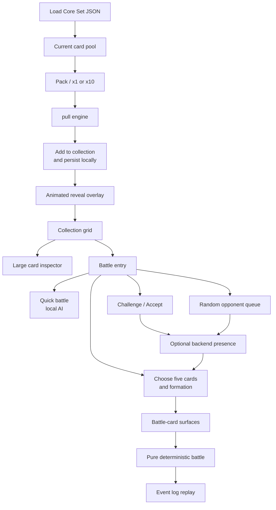
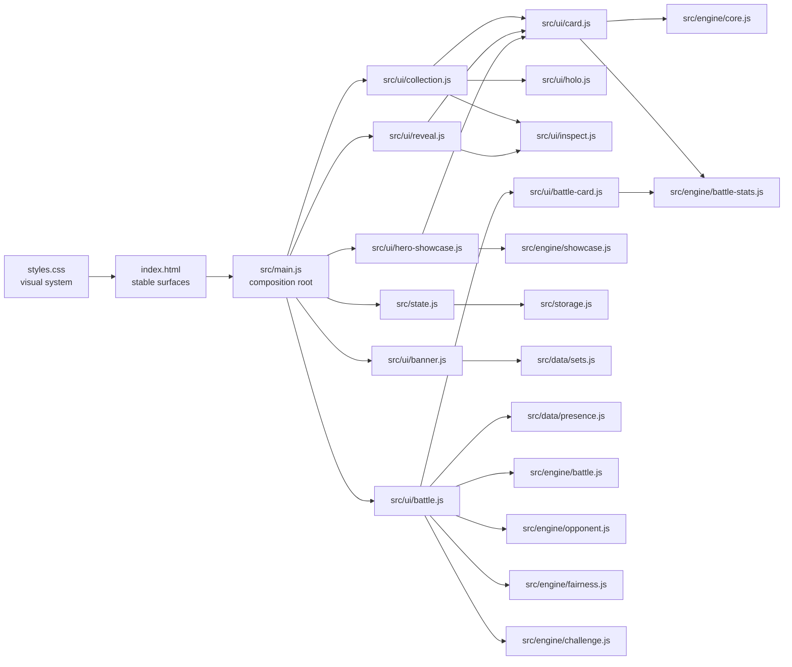
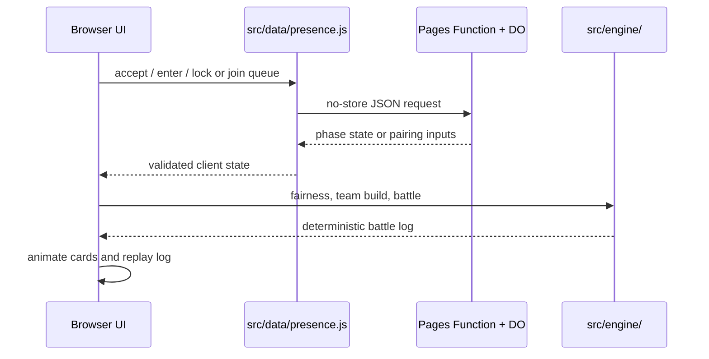

# Creator Gacha Frontend Architecture and UI Boundaries

## 1. Frontend Summary

Creator Gacha is a browser-first single-page game built from plain HTML, CSS, and native ES modules. There is no framework, bundler, or runtime application server. The frontend is both the product and most of the game engine:

- `index.html` provides the stable page surfaces and accessible control targets.
- `styles.css` defines the visual language, responsive layout, card materials, rarity treatments, and motion.
- `src/main.js` is the composition root. It wires the pull, collection, reveal, and arena modules together.
- `src/ui/` owns DOM rendering and interaction.
- `src/engine/` owns pure game rules and deterministic derivation.
- `src/data/` owns network adapters, including the optional backend presence service.
- `src/state.js` and `src/storage.js` own in-memory state and browser persistence.

The result is a deliberately small client architecture with a strong boundary between presentation and rules. The UI can animate, filter, scroll, and stage a battle without becoming the authority for rarity, stats, fairness, or combat.

## 2. Product Shape

The experience has three connected layers:

1. **The pack**: a single strong action that produces one or ten cards.
2. **The binder**: a persistent collection that lets the player search, filter, inspect, and choose cards.
3. **The arena**: a five-card battle workflow that can fight the local AI, a friend, or a random opponent.



A visitor can understand the application without knowing the implementation: open the pack, see the card material and rarity reveal, build a binder, then use the same creators as a tactical five-card team.

## 3. Visual Direction

The visual system treats the card as the primary product object, not as a generic grid tile.

### Palette and atmosphere

The page uses a dark plum stage with YouTube-red action accents and a multi-hue rarity ladder:

| Role | Current direction |
|---|---|
| Stage | Deep plum background with layered radial lighting |
| Primary action | Bright red play-button accent |
| Text | Warm near-white with muted lavender secondary text |
| N | Graphite gray |
| R | Blue |
| SR | Violet |
| SSR | Gold |
| UR | Red / ruby |
| RUBY | Red Diamond treatment |
| Battle elements | Independent colors for Gaming, Tech, Knowledge, Music, Comedy, Lifestyle, and Unaligned |

The page typography has separate jobs:

- **Anton**: display headings and the brand voice.
- **Space Grotesk**: body copy and general UI text.
- **Space Mono**: stats, labels, and compact numeric information.
- **Inter**: channel names at small card sizes, where legibility matters more than personality.

CSS variables in `styles.css` keep these decisions centralized. The layout uses a constrained `1120px` page width and responsive breakpoints rather than a separate mobile application.

### Page composition

`index.html` contains three primary regions:

- **Header**: brand mark, title, and concise premise.
- **Banner / stage**: the pack, x1/x10 choice, load status, and set metadata.
- **Collection panel**: binder heading, battle entry, collection controls, card grid, and empty states.
- **Footer**: legal/disclaimer content and the future roadmap.

The banner is visually warmer and more elevated than the binder because it is the first action. The binder is quieter and denser because it is a reading and management surface.

The pack is one native button rendered as a three-card stack. Its central play control is visual content inside that button, so pointer and keyboard activation share one pull path. The adjacent control selects one or ten cards but never starts a pull itself. On fine pointers the three layers fan apart using transforms; touch keeps the compact resting stack, and reduced motion removes the transition.

The page uses stable HTML IDs as module integration points. UI modules capture their own elements, while `main.js` passes behavior callbacks instead of making the modules reach into each other.

The home hero is collection-aware. An empty collection shows a bounded four-card preview spanning RUBY, UR, SSR, and SR from the active set. After the first banked pull, that layer is removed and the hero shows two owned-card rankings: most followed and strongest in battle. Selection and ranking live in `src/engine/showcase.js`, while `src/ui/hero-showcase.js` owns DOM presentation. See `HERO-SHOWCASE-ARCHITECTURE.md` for the state rules, maintenance path, and motion budget.

## 4. Module Map



### Composition root: `src/main.js`

`main.js` contains the application glue, not a second rules layer. It:

- reads the current pool;
- calls the pure gacha engine;
- adds pulled cards to shared state;
- persists once per pull, including x10 pulls;
- records session-only `NEW` and pull-order information;
- starts the pack-opening animation;
- opens the reveal overlay;
- connects the collection's Battle button to the arena;
- passes callbacks into banner and reveal modules.

The pull is resolved and persisted before animation begins. Animation is presentation of a settled result, so closing a tab during the flourish cannot lose a pull or change its outcome.

## 5. Card Architecture

There are two card views because they answer different player questions.

### Collection card: an object to want

`src/ui/card.js` renders the binder and reveal card. It prioritizes recognition, material, and desirability:

```text
card frame
  -> rarity badge and award-tier name
  -> channel title and handle
  -> large ringed avatar
  -> faint channel-initial monogram behind the avatar
  -> subscriber count and class
  -> ATK and DEF
  -> rarity-specific finish and star treatment
```

The card's visual identity comes from layered material rather than a flat colored rectangle:

- tier frame and bevel;
- ringed creator portrait;
- per-channel accent color sampled from the avatar;
- deterministic hash-color fallback when an avatar cannot be sampled;
- holo layer below the avatar so the creator image is not tinted;
- point twinkles on high tiers;
- a frame twinkle for UR;
- a distinct, restrained top-tier treatment for RUBY.

The visible ATK and DEF are derived by `battleStatsFrom()`, the same source used by combat. The collection card does not display decorative numbers that disagree with the battle system.

Avatar failures are non-fatal. A blocked or missing image is removed so the monogram and card material remain intact instead of showing a broken-image glyph. The `USE_EMBLEMS` switch is read in one place, and both collection and battle cards use `avatarUrlFor()` so visual fallback behavior stays consistent.

### Battle card: a tactical instrument

`src/ui/battle-card.js` reuses the same creator identity but changes the information hierarchy:

- smaller portrait to make room for combat information;
- rarity badge for recognition;
- element chip with matchup color and explanatory tooltip;
- class chip and class glyph;
- five stat rows: HP, ATK, DEF, SPD, and MOM;
- shape-share bars showing how the card's stat budget is distributed;
- absolute stat numbers beside those bars;
- class ability text;
- optional matchup badge;
- hidden health bar activated only during combat.

The bar is not a global power meter. It shows the card's internal shape share, while the number shows absolute value. This lets a specialist silhouette remain meaningful across rarity and size.

The arena uses these same rendered cards during the fight. Health state is added with `armHealthBar()` and `setHealth()` rather than by replacing the card with a separate combat-only object.

### Card states

The main card states are:

| State | Surface | Meaning |
|---|---|---|
| Back | Reveal overlay | A pull result exists but has not been shown |
| Revealing | Reveal overlay | Rarity-ranked flip and spoiler beam are in progress |
| Revealed | Reveal, binder, inspector | The channel is visible and can be inspected |
| New | Binder card | This channel was first acquired during the current session |
| Stacked | Binder card | `count > 1`, shown as a count badge |
| Missing avatar | Any card | Portrait removed; monogram/material remain |
| High rarity | Any card | Rarity-specific stars and finish are active |
| Draft | Arena | Card is selected in a build slot |
| Locked | Arena | Card belongs to a submitted final team |
| In combat | Arena | Health bar and downed state are active |
| Matchup | Arena | Element strength/weakness against the visible enemy team |

The collection card carries `NEW` and duplicate count because those are collection concepts. The battle card carries matchup, class, element, and health because those are combat concepts.

## 6. Pull and Reveal Flow

### Set loading

`src/ui/banner.js` owns the initial card-load state:

1. The pack begins disabled.
2. The banner tries the committed manifest and then the built manifest.
3. The first available set is loaded and validated through `src/data/sets.js`.
4. `state.setsPool` becomes cards through `toCard()`.
5. Existing collection entries still present in the set are reconciled and refreshed.
6. The pack becomes enabled only after a non-empty pool exists.
7. A load failure leaves the pack disabled and exposes Retry.

There is no fictional fallback pool. A disconnected first load is an explicit error rather than an invented collection.

### Pull resolution

`src/engine/gacha.js` uses a two-stage pull:

1. choose a rarity band using fixed band weights;
2. choose a card uniformly inside the selected band.

This keeps the drop curve independent of how many cards happen to be present in each band. x1 and x10 select the number of draws; the pack itself remains the single primary action.

### Reveal choreography

`src/ui/reveal.js` turns a completed pull into a controlled sequence:

- cards reveal in rarity order, with rarer cards later;
- a color-coded pre-flip beam telegraphs rarity before the face appears;
- the card flips and emits a seam glow as it lands;
- high rarities retain lightweight star effects;
- the overlay supports card inspection and Pull again;
- dismissing the finished reveal can return the player to the binder;
- phones and desktop receive the same simplified reveal;
- `prefers-reduced-motion` collapses the choreography to a calm immediate state;
- reveal layout uses viewport-aware column caps: two columns on phones, three on tablets, five on desktop;
- scroll snapping and optional short haptic ticks support the mobile reveal without changing the result.

The removed high-cost sweep, aura, and multi-beat finale are not part of the current behavior. The current design spends motion on suspense and material feedback rather than spectacle for its own sake.

## 7. Collection and Persistence

`src/state.js` is the shared client state:

```text
state
  setsPool       current loaded cards
  currentSet     slug, title, snapshot date
  collection     Map<channel id, { card, count }>
```

`src/storage.js` is the only module that touches `localStorage`:

- collection data is stored under `creator-gacha:collection:v1`;
- lineup IDs are stored separately under `creator-gacha:lineup:v1`;
- channel snapshots are persisted, not derived rarity or combat numbers;
- loading re-derives cards from the stored channel snapshot;
- a current set refreshes owned cards that remain in print;
- invalid or unavailable storage degrades to an in-memory session;
- Clear collection removes both collection and lineup storage.

Collection view state is intentionally session-only:

- search query;
- rarity filter;
- selected sort;
- pull sequence and `NEW` markers.

The collection module uses delegated event handlers so the grid can be rebuilt without rebinding every card. Search is debounced, sorting derives stats from the single battle-stat function, and high-rarity star fields are attached near the viewport to avoid thousands of off-screen animated nodes.

## 8. Binder Interaction Model

`src/ui/collection.js` owns the binder as a reading surface:

- search by title or handle;
- filter by all six rarity bands, including empty bands;
- sort by rarity, recent pull, ATK, DEF, subscribers, or name;
- inspect a card by click or keyboard activation;
- show duplicate counts;
- clear all local collection data after confirmation;
- expose Battle even before five cards, so the arena can explain the requirement instead of hiding it behind a disabled control.

The binder intentionally does not act like an operator dashboard. It does not expose the set denominator or drop table to players, and it does not turn rarity filters into progress counters. Empty rarity filters are useful because they answer the player's question, "What am I chasing?"

## 9. Inspector and Visual Continuity

`src/ui/inspect.js` provides the larger admire/inspection surface. It uses the same collection card renderer and accent logic rather than inventing a third card language. This keeps the creator portrait, tier frame, stats, and star behavior recognizable across:

- collection grid;
- pull reveal;
- card inspector;
- battle draft;
- live combat.

The difference is scale and surrounding context, not identity. A player should feel that the card they pulled is the card they are now building with.

## 10. Arena Frontend and Backend Handoff

`src/ui/battle.js` is the arena workflow coordinator. It owns temporary match UI state such as:

```text
mode, phase, stage
lineup and selected slot
enemy preview for manual fallback
challenge and room identifiers
side, seat claim, and queue ticket
last room state
fairness gate and eligible pool
lobby/build deadlines
locked state and pending fight
```

The arena has three production modes:

### Quick battle

- uses the local collection and current pool;
- rolls an AI collection using the same rarity curve;
- builds the AI's best five with the same selection rules;
- requires no server and works when the player is alone or offline after the set is loaded.

### Challenge / Accept

- a challenge code carries the shared seed, pinned time, team information where applicable, fingerprint, and collection size;
- both browsers derive or receive the same room identity;
- the optional presence backend coordinates acceptance, shared build, final locks, and cancellation;
- both sides build blind in the live path;
- if the backend is unavailable, supported flows fall back to the manual sequential path.

### Random opponent queue

- the browser creates a temporary queue ticket and sends only its collection size;
- the queue returns a room, side, seed, pinned time, and opponent collection size;
- the matched players then enter the same room protocol as a friend challenge;
- the queue does not introduce a second battle implementation.

The frontend/backend relationship is intentionally asymmetric:



The server coordinates agreement. It does not render cards, calculate stats, resolve the fight, or send a winner verdict.

## 11. Arena Phases and UI States

The live arena is a state machine visible through screens rather than URL routes:

```text
mode selection
  -> challenge/accept/queue setup
  -> lobby gate
  -> shared blind build
  -> locked face-off
  -> combat replay
  -> result / rematch / exit
```

Important live states include:

- presence unavailable: explain or fall back rather than hanging;
- waiting for a challenge acceptance;
- defender seat already taken;
- collection-size fairness gate;
- lobby decision window;
- opponent still entering;
- shared build countdown;
- current lineup with empty and filled slots;
- Auto Build and manual slot selection;
- independently locked team;
- opponent locked while the player is still building;
- both teams locked and face-off countdown;
- combat with active health bars and downed cards;
- stalled or expired room with an actionable exit.

The frontend converts every server timestamp to a fixed local deadline once. It does not recompute a new deadline on every poll, which keeps both browsers counting down against the same server-anchored moment.

## 12. Responsive and Accessibility Architecture

Responsive behavior is implemented through CSS and small viewport-aware decisions in the reveal, not through a second markup tree.

- The page is constrained on desktop and padded on narrow screens.
- The banner and collection panels collapse naturally within the same document.
- Reveal cards use two columns on phones, three on tablets, and five on desktop.
- Cards maintain stable dimensions so text, stars, health bars, and badges cannot resize the grid.
- Interactive controls receive visible `:focus-visible` outlines.
- Native buttons, inputs, selects, status regions, and dialog-like surfaces are used where appropriate.
- Collection cards support keyboard activation.
- Status text uses live regions for loading and pull feedback.
- Images use `referrerpolicy="no-referrer"`.
- Reduced motion removes choreography and haptic feedback.
- Failed avatars disappear cleanly rather than leaving broken-image artifacts.

The design favors progressive enhancement: tilt, avatar sampling, stars, haptics, and live presence improve the experience when supported but are not prerequisites for playing.

## 13. Design Invariants

These are the frontend rules most likely to preserve the identity of the application:

1. **The pack is the primary action.** x1/x10 changes pack size; it does not create competing pull buttons.
2. **The card carries the visual value.** Frames, avatar rings, finish layers, and rarity treatments are not decoration around a generic tile.
3. **Collection and battle cards share identity but not information density.** Do not force tactical data onto the collectible face.
4. **The avatar remains inspectable.** Finish layers stay below it; the highest available thumbnail is preferred.
5. **One derivation feeds every surface.** Card stats shown in the binder must agree with the battle card and combat engine.
6. **The UI stages settled results.** Pulls and battles are resolved before their animations play.
7. **Live coordination is optional.** A backend failure must never make Quick battle unavailable or strand a supported manual flow.
8. **A promise must have a visible state.** Do not hide an unavailable battle behind a disabled button; explain the requirement in the arena.
9. **Rarity is expressed through both language and material.** The band badge, award-tier name, color, frame, beam, and stars should agree.
10. **The frontend must remain honest about persistence.** Collection data is local and deletable; API credentials are not stored by the shipped UI.

## 14. Reading This Beside the Backend Architecture

The companion backend document describes the Pages Functions and Durable Objects as a short-lived coordination layer. This document supplies the other half of that picture:

- the backend shares phase state and battle inputs;
- the browser owns card presentation and local collection state;
- pure engine modules own rarity, stats, fairness, opponent selection, and combat;
- the arena translates backend state into screens and deadlines;
- both browsers independently replay the same deterministic battle.

Together, the two documents describe a game whose persistent-feeling object is the card in the player's binder, while the server exists only long enough to help two browsers agree on a fair, reproducible match.
