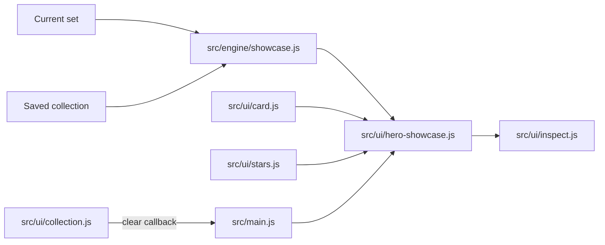

# Home Hero Showcase Architecture

## Purpose

The home hero changes with collection state:

1. A first-time visitor sees a credible preview of desirable cards in the current set.
2. A returning player sees useful summaries of their own collection.

The hero never invents a card and never maintains a second card design. Every visible card is produced by `src/ui/card.js` from current set or saved collection data.

## State model

The collection is the source of truth. No additional onboarding flag is stored.

| Collection state | Hero state | Content |
|---|---|---|
| Empty | Onboarding | MrBeast, Taylor Swift, Rihanna, and Austin Evans when present in the active set |
| One or more cards | Owned | Separate most-followed and strongest-in-battle rows |
| Cleared | Onboarding | The current-set showcase returns |

A successful pull updates the hero immediately after the collection is persisted and before the pack-opening animation begins. The showcase therefore disappears at the first completed pull decision, even while the reveal presentation is still running.

This feature has no backend dependency and introduces no network request. Featured cards come from the already loaded set, and owned cards come from the existing local collection. It does not change the collection storage schema or add a local-storage key.

## Module boundaries



- `src/engine/showcase.js` is pure. It selects editorial showcase cards and ranks owned cards.
- `src/ui/hero-showcase.js` renders either hero state and wires every displayed card to the existing inspector.
- `src/main.js` refreshes the hero after set load and immediately after a pull is banked.
- `src/ui/collection.js` reports its internally owned clear action through a callback. It does not import the hero.
- `index.html` supplies stable containers only.
- `styles.css` positions cards around those containers without changing card faces, materials, rarity rules, or effects.

## Featured card maintenance

The first-visit roster is the ordered `FEATURED_HANDLES` array in `src/engine/showcase.js`:

```js
['@mrbeast', '@cristiano', '@rihanna', '@austinevans']
```

The lineup demonstrates the four highest pull tiers in descending order: RUBY, UR, SSR, and SR/Gold. This is based on current set data. A future subscriber-threshold crossing may require an editorial replacement to preserve the four-tier demonstration.

Handles are used because they are readable in review and stable across weekly statistics refreshes. Selection is performed against the loaded set. If a named creator is removed or absent, that slot is skipped; stale creator data is never bundled as a fallback.

The official `@cristiano` channel title includes the `UR` prefix. The hero aliases it to `Cristiano Ronaldo` because the card badge already communicates rarity. The source set object remains unchanged.

To change the lineup, edit the array and run `npm test`. Keep the list at four unless the composition and motion budgets below are deliberately revised.

## Owned ranking rules

The owned hero answers two different questions:

- **Most followed** sorts by subscriber count. Rarity, battle power, and title provide stable tie breaks.
- **Battle leaders** sorts by `powerOf(battleStatsFrom(channel))`, the same composite rating used by matchmaking. Rarity, subscriber count, and title provide stable tie breaks.

Duplicate count affects neither ranking because another copy does not make the card stronger or the creator larger. Each row renders up to three unique cards. A card may honestly appear in both rows when it leads by both measures.

A weekly data refresh can legitimately change either ranking because saved card snapshots are refreshed from the active set before the hero renders.

## Card-design boundary

The showcase calls `renderCard()` and adds the existing `makeStars()` field for eligible tiers. It does not duplicate card markup or define rarity appearance. Hero CSS may size, overlap, rotate, or translate a card's wrapper. It must not style card internals such as `.card-inner`, `.holo`, `.avatar-ring`, rarity frames, badges, stats, or star shapes.

Owned top cards and first-visit showcase cards are keyboard and pointer accessible. Both open the existing inspector; the first-visit cards are preview-only and are never added to the collection by inspection.

## Motion and performance budget

- Maximum aspirational cards: four on desktop and phones.
- Motion: one slow `transform` animation per wrapper.
- Aura: one static radial gradient per wrapper, with no blur or filter.
- No per-frame JavaScript.
- No hero backdrop filter, particle emitter, or layout animation.
- Reduced-motion mode disables drift completely.
- The aspirational DOM is removed as soon as the collection becomes non-empty.
- Owned mode renders at most six card instances across two bounded rows.

These limits keep the hero bounded independently of collection size and preserve the optimized pull path.

## Verification checklist

1. Empty storage shows current-set showcase cards only after the set loads.
2. The showcase presents MrBeast/RUBY, Taylor Swift/UR, Rihanna/SSR, and Austin Evans/SR while they remain in those set bands.
3. Completing the first pull removes all `.hero-float` nodes before reveal dismissal.
4. Each first-visit showcase card opens the inspector with click, Enter, or Space.
5. Owned mode shows separate subscriber and battle-power rows and every card opens the inspector.
6. Clearing the collection restores onboarding mode.
7. Phone and desktop layouts have no horizontal overflow.
8. `prefers-reduced-motion: reduce` leaves showcase cards static.
