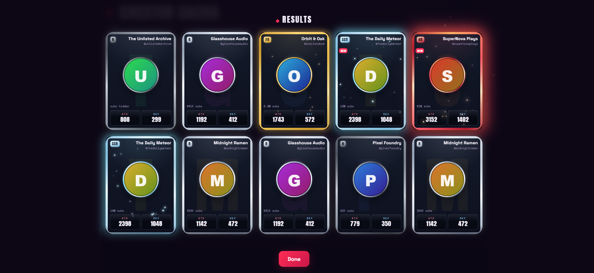

# Creator Gacha

> Pull collectible trading cards minted from real YouTube channel stats.
> A browser-based gacha game where a channel's numbers *become* the card.

**▶ Play it: [creator-gacha.pages.dev](https://creator-gacha.pages.dev)** — no signup, no API key,
23,000+ cards.

[](https://github.com/ashishbarthwal/creator-gacha-card-game/actions/workflows/test.yml)

A fan tribute to [Wikigacha](https://en.wikipedia.org/wiki/Wikigacha) (Harusugi, Feb 2026),
which plays the same trick with Wikipedia article metrics. This one does it with YouTube:
subscriber count sets a card's rarity, view count drives its attack, video count its defense.

**This is a portfolio piece, not a business.** The derivation logic is deliberately pure and
deterministic — it exists partly to be tested in public.



---

## The core idea

| Wikigacha | Creator Gacha |
|---|---|
| Article quality rank → rarity | **Subscriber count → rarity** |
| Pageviews → ATK | **View count → ATK** |
| Article length → DEF | **Video count → DEF** |

Rarity bands scale with subscribers:

| Band | Subscribers |
|---|---|
| **N**   | under 100K |
| **R**   | 100K – 1M |
| **SR**  | 1M – 10M |
| **SSR** | 10M – 50M |
| **UR**  | 50M and up |

Rarer cards are weighted to pull less often, and hit ATK/DEF harder.

---

## Run it

It's already running at **[creator-gacha.pages.dev](https://creator-gacha.pages.dev)** —
the rest of this section is for running it locally.

No build step, no dependencies — plain ES modules under `src/`, served as-is.

- **Serve the folder** with any static server, then open `index.html`. The app is ES
  modules, so `file://` double-click won't work (browsers block module imports over
  `file://`), and the server must send a JavaScript MIME type for `.js`:
  - `npx serve` (recommended — correct MIME types out of the box), or
  - `python -m http.server` **only** if your OS maps `.js` to `text/javascript`; some
    setups (notably Windows) serve it as `text/plain`, which browsers reject for modules.
    GitHub Pages / Cloudflare Pages serve it correctly, so deployment is unaffected.
- **Sets mode** is the only mode a player sees — pick a card set and pull, with no API key and
  no setup at all. The bundled **demo set** ships fictional channels with generated avatars and
  zero network, so the first paint is instant and works offline; the real Series takes over the
  moment it loads. Pull ×1 / ×10, watch the reveal, build a collection.
- **Live mode** is now **dev-only** (`?dev=1`). It pulls arbitrary real channels with your own
  free [YouTube Data API v3](https://developers.google.com/youtube/v3/getting-started) key,
  pasted into the app, and it is also where in-page Magic Search lives. The key stays in the
  page's memory — never stored, never logged, never sent anywhere except `googleapis.com`.
  It went behind the flag on 2026-08-03: asking a player for a Google Cloud key to reach a
  thinner version of what the front page already does is a wall in front of the game. The
  live adapter itself is untouched — `tools/add-candidates.js` runs on it.

  In dev, add channels by `@handle`, channel URL, or `UC…` id. (Vanity `/c/` URLs aren't
  supported yet.)

---

## How it's built

Two structural ideas do the heavy lifting:

**The data seam.** The bundled `demo` set, fetched `sets` (curated JSON snapshots), and
`live` all produce an *identical* channel object shape, so nothing downstream can tell them
apart. This is why the app runs offline, why tests never need an API key, and why the demo
set is a real adapter rather than a hack. Adding the `sets` source needed no changes to the
gacha, reveal, render, or collection code — it's just another pool behind the seam.

**The pure core.** `rarityFromSubs` and `statsFrom` are pure and deterministic — no I/O, no
randomness, no DOM. They sit between the data seam and everything stateful, which makes them
the natural test target. The gacha engine takes an injectable RNG (`rng = Math.random` as a
default parameter) so pulls can be tested with a fixed seed.

Both live in `src/engine/`, because the source tree is organized by *what a module may touch*
rather than by topic: nothing → `src/engine/` (headless — it would run unchanged in Node),
the network → `src/data/`, the DOM → `src/ui/`. A new file's home follows from one question.

```
input (@handle | URL | UC id)
        │
   resolve to channelId
        │
   ┌──────┼────────┐           ← the data seam
 demo     sets    live (YouTube Data API v3)
 (bundled)(JSON)  (user key)
   └──────┼────────┘
        │
  derivation core (PURE)        ← rarityFromSubs, statsFrom
        │
  gacha engine (weighted RNG, ×1/×10, dupes stack)
        │
  collection → card render + reveal
        │
  battle (PURE, seeded)         ← the same channel object, read a second way
        │
   ┌────┴────┐
 vs AI    vs a player  ← a pasted code carries teams + seed + pinned clock,
                          so both windows replay the identical fight
```

The battle layer is the data seam's second payoff. A card's five combat stats are derived
from the *same* channel object the rarity and ATK/DEF came from — nothing new is fetched, and
nothing downstream can tell a demo channel from a live one. Because that derivation is pure
and the fight takes its randomness and its clock as parameters, two browsers that share
nothing at all can be handed one string and resolve the same battle independently.

Vanilla JS, ES modules, no framework, no bundler. Fonts: Anton / Space Grotesk / Space Mono.

### Tests

452 Vitest tests pin the pure core — every rarity boundary from both sides, hidden and
malformed subscriber counts, monotonic stat scaling — the gacha engine under a seeded RNG (so
the drop-rate distribution is an exact assertion, including that the odds don't move when a
band is padded with 200 more cards), the card-set adapter's validation, the discovery
engine, whose query jitter is reproducible under an injected clock and seed, and the candidate
DB, where two tests carry real weight: that a committed record leaks no channel data even
through JSON, and that an opted-out creator stays out when a later sourcing run finds them
again. CI
runs them on every push (that's the badge above); each run uploads a self-contained HTML
report as an artifact.

Two blocks in there are doing something different from the rest, and are worth naming. The
**balance block** asserts *design goals* rather than behaviour — that a well-shaped small card
can out-rate a giant, that no class swallows the deck, that an even match stays even — so a
tuning change that quietly re-couples power to channel size fails a test instead of being
noticed months later by a player. And the **battle-code round trip** resolves the same fight
twice, once from live objects and once from a decoded string, and asserts the two event logs
are *identical*: if those ever diverge, two players are watching different battles, which is
the one failure this feature cannot survive.

```
npm test              # run the suite
npm run test:report   # also write reports/: JUnit XML + a double-clickable HTML report
```

Vitest is the repo's only dependency, dev-only — the shipped app has none.

---

## Roadmap to the end goal

The game began as a single working `youtube-gacha.html` prototype and has since been split
into a tested, modular, deployable project in dependency order (full detail in
[`PLAN.md`](PLAN.md), design rationale in [`DECISIONS.md`](DECISIONS.md)):

- [x] **Prototype** — working single-file build: data seam, pure core, weighted gacha,
      reveal animation, in-memory collection.
- [x] **WP0 — Split the monolith.** Broke the single file into a pure core, the gacha
      engine, `src/data/*` (the seam), `src/ui/*`, `src/state.js`, `src/main.js` (wiring).
      Zero behavior change; `index.html` is now the entry point. (The core and the pull
      engine later moved together into `src/engine/`.)
- [x] **WP1 — Test suite.** Vitest against the pure core: exact rarity boundaries, hidden /
      malformed subscriber counts, monotonic stat scaling, seeded-RNG gacha distribution.
      56 tests as delivered, `npm test`, dev-only dependency. (The suite has grown with every
      WP since; the current total is above.)
- [x] **WP2 — Footer.** Buy Me a Coffee tip jar (passive, never tied to game state) plus the
      "not affiliated with YouTube/Google" disclaimer.
- [x] **WP3 — Holographic cards.** Pointer-tracked tilt + holo shine gated by rarity, with
      reduced-motion and touch fallbacks. Grew into a full card redesign: metal-bevel frames
      on a tier system mapped to the YouTube Creator Awards (Silver/Gold/Diamond/Red Diamond),
      a click-to-enlarge inspector, and the inline CSS split out to `styles.css`.
- [x] **WP4 — Card sets.** A sets adapter behind the seam, a `sets/index.json` manifest, and a
      **Sets** banner mode that pulls from curated static JSON with no API key. Demo mode was
      folded into a bundled demo set, so the default view paints instantly and works offline.
      The pull became two-stage (band first, then card), so drop rates follow the weight table
      instead of whatever shape the roster happens to have.
- [x] **WP5 — Magic Search.** Keyword → channel discovery: a pure sourcing core
      (`engine/discover.js` — query build, uploader harvest, floor, pool tag), the live
      `search.list` → `channels.list` fetch, a CLI that accumulates into a gitignored draft, and
      in-page tier buttons.
- [x] **WP6 — Discovery quality.** Seeded query jitter (both live callers had it disabled), a
      generated keyword vocab, a subscriber ceiling, and three tier buttons that steer the
      *search* rather than just filtering it. Bands derive from one constant so a tier can't
      drift from the pool it sorts into.
- [x] **WP7a — Creator opt-out.** A real contact route in the footer and a stated policy:
      removal honored within 7 days, no identity check. Shipped deliberately *before* the first
      real-creator set, since an opt-out that arrives after one is already too late.
- [x] **WP7 — Set-build pipeline.** Two committed artifacts and one that never is.
      `catalog/candidates.json` holds channel IDs, our own tags and the opt-out denylist —
      never channel data, because anything in git is permanent and could satisfy neither the
      30-day storage cap nor a promised removal. `build-set.js` hydrates those IDs into a full
      set, re-runs the region filter on *fresh* data, and writes to a gitignored `sets/built/`.
      The published record is assembled from a positive allowlist, so a self-declared `country`
      cannot reach a shipped file by omission. Sets are minted at deploy, on the one machine
      that can hold an API key without writing to a git history.
- [x] **WP12 — Pull reveal theatre.** Built out of sequence: the pull is the moment the game is
      *for*, and it was the weakest thing on screen. Rarity-escalated flip order, a beam
      telegraph, specular sweep, SR+ twinkling stars, and a three-beat UR finish — all CSS, with
      a reduced-motion path that stays still but keeps the rarity halo.
- [x] **WP8 — Production hardening.** Dev affordances gated behind a runtime dev/prod flag
      (hostname-detected, since there is no build step to compile a constant into), and an
      avatar-source switch that can swap every real profile picture for a generated emblem
      without a fork. That switch is what makes shipping real faces a reversible decision
      rather than a permanent one.
- [x] **WP9 — The decks + persistence.** A band cap so a chase card stays reachable, pins so a
      set's headline cards can't be hashed out, seeded printing rotation, a localStorage
      collection that reconciles against the loaded set, a refresh alarm (warn at 25 days,
      refuse at 30), and the curation exclude.
- [x] **WP10 — Deploy.** Live at
      [creator-gacha.pages.dev](https://creator-gacha.pages.dev) (moved from Netlify
      2026-08-03 — same direct-upload shape, no credit ceiling). Direct upload of a locally
      assembled `_site`, never a CI build for the deploy step itself — the set has to be
      hydrated with a real API key and can never be committed. Four guards run before
      anything uploads: no drafts, no `country` field, nothing past the 30-day statistics
      cap, no page linking to a page that didn't ship. Plus a
      [privacy policy](https://creator-gacha.pages.dev/privacy.html) and
      [terms](https://creator-gacha.pages.dev/terms.html).
- [x] ~~**Card → PNG export.**~~ Built, then **scrapped before shipping**. An exported image
      outlives a removal request, so the feature quietly broke the opt-out promise. Deleted
      rather than hidden behind a flag.
- [x] **WP-Arena — battles, and a real 1v1.** The 5v5 engine had been shippable since
      2026-08-05 with no way to reach it; this is the arena in the app — a team builder over
      your own cards, front/back ranks, and three ways to fight (a matched AI, a challenge you
      hand out, a challenge you accept).

      **Two players share one fight without sharing anything.** A normal window and an
      incognito one are storage-partitioned by design, so the channel between them is the
      *player*: a pasted code. What makes that a real 1v1 rather than two simulations is a
      property the engine already had for an unrelated reason — combat takes its randomness as
      an injected `rng` and its clock as an injected `now`, both so the balance tests could
      seed thousands of runs. Same teams, seed and clock ⇒ both windows replay the identical
      fight, hit for hit. The reply carries *inputs, not a verdict*, so a claimed outcome never
      has to be trusted.

      A small match lobby was added afterwards (the one exception to the guardrail below) so
      the two sides can see each other arrive and start on the same countdown.
- [x] **WP-Lobby — the room goes live, and two bugs only real play could find.** The lobby
      shipped inert (no KV namespace bound); binding it produced a genuine cross-device 1v1 on
      two machines and two networks, with no account, password or email anywhere in it — the
      challenge code *is* the credential and consent *is* the access control. Then two failures
      that no test would have caught. **Readiness was being inferred rather than performed:**
      committing a team and pressing Ready were one server op, so the defender was marked ready
      on leaving the builder and the challenger alone could start a fight nobody had agreed to.
      **And a dropped request was indistinguishable from a missing lobby:** challenging from a
      phone meant leaving the app to paste the code, mobile froze the tab, the poll died, and
      the wait loop concluded there was no lobby anywhere — permanently. Now `off` (settled)
      and `error` (retry) are different answers, and the loops wake on `visibilitychange`
      instead of waiting out a throttled timer.
- [x] **WP-Battle Tuning — nobody is zero at anything.** 3.7% of the deck sat at an axis of
      exactly 0, which became an attack of **1** — roughly 590 real channels, typically the
      daily grinder whose views-per-video is modest precisely *because* they upload constantly.
      A residual measured against a trend means below average, not absent, so the axes floor at
      12; small cards out-rating the median giant went 22.1% → 29.5%. Crit also moved from
      cadence to **punch**: a critical hit is a video landing far above this channel's normal,
      not a channel that posts often. The tuning knobs are now exported and printed live by
      `tools/battle-balance.js`, alongside a per-class table — which immediately showed the
      next problem, Assassin rating 249 against Carry's 462.
- [x] **WP-Battle Balance — the game was solved, and not for the obvious reason.** Picking the
      biggest-subscriber cards was already a *bad* strategy (it lost to a views-per-video team
      70.8% of the time). The real problem: the combat rating predicts fights accurately, and
      an accurate predictor is a solved game — "take the five highest-rated" beat everything
      87–100%, and Auto-pick computes exactly that. Fixed by de-sizing the two axes that had
      never had it (`devotion` and `cadence` were leaking channel size at 0.350/0.420),
      repricing stats that were worth wildly different amounts at equal budget (momentum bought
      a *seventeenth* of what health did), and adding a formation bonus that depends on the
      shape of the *team* — the one thing a per-card rating cannot see. A channel 10× smaller
      now out-rates a bigger one 39% of the time.
- [ ] **Next.** SSR-band depth (the binding constraint at 92.8 lower walls), Series 2 rotation,
      and procedural creator emblems to dissolve the likeness question entirely.

---

## Design guardrails

A few decisions are deliberately locked (see [`DECISIONS.md`](DECISIONS.md) for the full log):

- **No monetization in the game.** No paid pulls, currency, perks, or ads. The one exception
  is a passive Buy Me a Coffee link that never unlocks anything in-game.
- **Client-side only, with one named exception.** Static hosting, no accounts, no database.
  Cards ship as static JSON, so a player needs no API key — the key only ever exists on the
  machine that builds a set. The exception, added 2026-08-08, is a single endpoint
  (`functions/api/ready/[room].js`) that holds one two-player match for ten minutes so both
  players can start a battle together. It is optional by construction: when it is unreachable
  the game falls back to the copy-paste flow it shipped with.
- **No build step.** Plain ES modules, served as-is. Vitest is a dev-only dependency.

---

## Disclaimer

Unofficial fan project. **Not affiliated with or endorsed by YouTube or Google.** Channel data
is retrieved via the YouTube Data API and belongs to the respective creators and Google. Cards
use publicly available channel information.

**Creators:** if you'd like your channel left out, email
[ashish.barthwal.cs@gmail.com](mailto:ashish.barthwal.cs@gmail.com?subject=Creator%20Gacha%20%E2%80%94%20card%20removal%20request).
Removal is honored within 7 days, with no identity check — the same policy and address as the
in-app footer. Removals are permanent: an excluded channel is recorded in `catalog/denylist.json`
and re-enforced on every future sourcing run, so it cannot be silently re-added later.

## License

None — this is a personal portfolio project. The code is public to read and learn from, but it
is **not** licensed for reuse. © 2026 Ashish Barthwal. All rights reserved.
