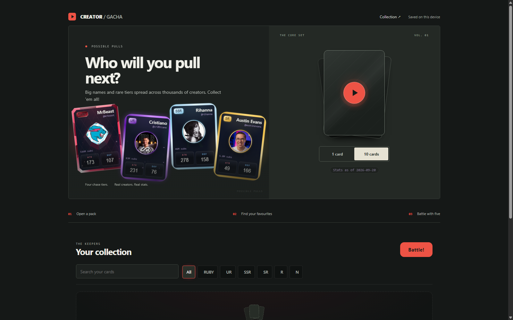
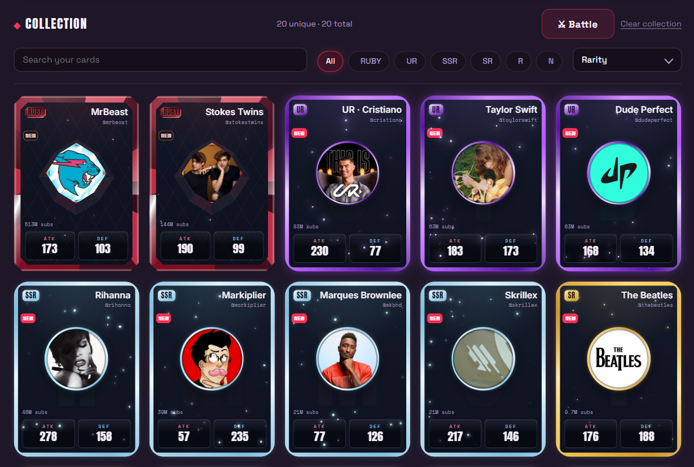

<h1 align="center">Creator / Gacha</h1>

<p align="center">
  <strong>Real YouTube creators, collectible cards, and a five-card battle team.</strong><br>
  Open a pack. Find a favourite. Pull something rare.
</p>

<p align="center">
  <a href="https://creator-gacha.pages.dev/"><strong>Play the live game</strong></a>
  &nbsp;&middot;&nbsp;
  <a href="https://github.com/ashishbarthwal/creator-gacha-card-game/releases/tag/wp-v2-ui-overhaul">V2 release notes</a>
  &nbsp;&middot;&nbsp;
  <a href="WP-V2-UI-OVERHAUL.md">V2 UI work package</a>
</p>

<p align="center">
  <a href="https://github.com/ashishbarthwal/creator-gacha-card-game/actions/workflows/test.yml"></a>
  
  
</p>

---

## Who will you pull next?

The V2 landing screen puts the pull fantasy first: four clickable chase cards, a compact pack
control, and a collection that becomes personal after a player's first pull. It is designed to
feel as good on a phone as it does on a desktop, without asking a new player to read a manual.



## Six tiers. One collection.

Subscriber count sets rarity; a card's own performance shapes its battle stats. The result is a
deck where a giant creator is a genuine chase pull, while each card still has a role in a team.

| Tier | Audience | Card treatment |
| :--- | :--- | :--- |
| **RUBY** | 100M+ subscribers | Red-diamond crystal frame, deep sheen, and a rare pull moment |
| **UR** | 50M - 100M | Violet frame, dense star field, and roaming edge light |
| **SSR** | 10M - 50M | Icy blue halo and bright star detail |
| **SR** | 1M - 10M | Gold frame and warm spark detail |
| **R** | 100K - 1M | Silver frame |
| **N** | Under 100K | Clean steel frame |

<p align="center">
  
</p>

Each tier has its own visual language, but the actual creator art and card identity stay intact
wherever the card appears: the first-visit showcase, pull results, collection, and admire view.

## What players do

1. **Open a pack** - choose one card or ten, then reveal the pull with responsive motion that
   respects reduced-motion settings.
2. **Collect creators** - cards persist locally on the player's device. New players see chase
   cards; returning players see their own strongest pulls.
3. **Build a five-card team** - sort the collection, make a formation, and battle a matched AI
   or another player through a shared lobby.

## The game behind the cards

Creator Gacha uses public YouTube channel data. The rules are deliberately deterministic, so the
same channel always receives the same rarity and base battle identity.

```text
YouTube channel data
        |
        +--> subscriber count ------------> rarity tier
        |
        +--> views per video / subscriber -> battle stats
                                                |
                                                +--> packs, collection, and 5v5 arena
```

Attack and defense do not simply mirror audience size. They are derived from how a channel
performs against what creators of a similar size normally achieve, so a smaller creator can have
a distinctive, useful battle profile.

## Built to stay simple

- **Vanilla JavaScript and ES modules** - no frontend framework or production bundle.
- **Static card sets** - curated JSON ships with the site; players need no account or API key.
- **Cloudflare Pages** - static game delivery, with a small room service for live two-player
  lobbies.
- **Local-first collection** - cards are stored in browser storage and reconciled against the
  current Core Set.
- **Accessible motion** - touch and desktop share the same card language; reduced motion keeps
  the hierarchy without forcing animations.

## Run it locally

```bash
npm install
npm run dev
```

`npm run dev` starts the Pages development environment. For static UI work only, use
`npm run dev:static`. The two-player lobby requires the room worker in a second terminal:

```bash
npm run dev:room
```

Useful project commands:

```bash
npm test             # 628 automated checks
npm run build:site   # assemble the deployable site into _site/
npm run deploy       # hydrate the set, build, deploy, and record the release
```

## Project notes

- [V2 UI overhaul work package](WP-V2-UI-OVERHAUL.md) - layout decisions, persistence rules,
  motion rules, and verification notes.
- [Frontend architecture](FRONTEND-ARCHITECTURE-05-09-2026.md) - UI modules and state flow.
- [Backend architecture](BACKEND-ARCHITECTURE-05-09-2026.md) - data sourcing, deployment, and
  room services.
- [Design decisions](DECISIONS.md) - the durable product and data choices behind the project.

## Creator and data policy

Creator Gacha is a personal portfolio project, not a commercial product. It is an unofficial fan
project and is not affiliated with or endorsed by YouTube or Google. Channel data comes from the
YouTube Data API and belongs to the respective creators and Google.

Creators can request removal at
[ashish.barthwal.cs@gmail.com](mailto:ashish.barthwal.cs@gmail.com?subject=Creator%20Gacha%20card%20removal%20request).
Requests are honoured within seven days, with no identity check, and exclusions are preserved in
future set builds.

## License

This is a personal portfolio project. The code is public to read and learn from, but it is not
licensed for reuse. Copyright 2026 Ashish Barthwal. All rights reserved.
